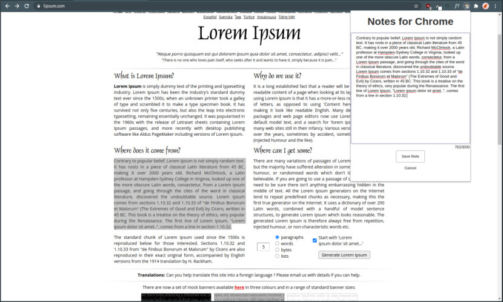
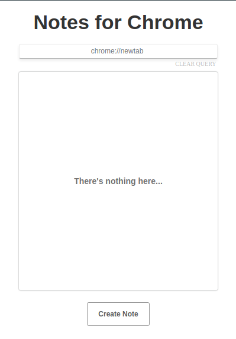
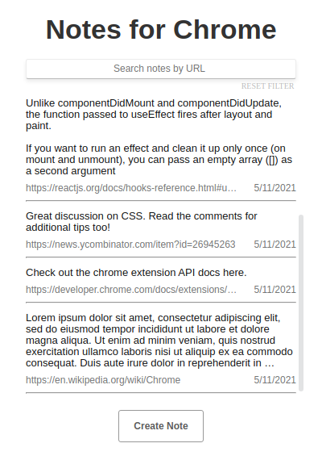
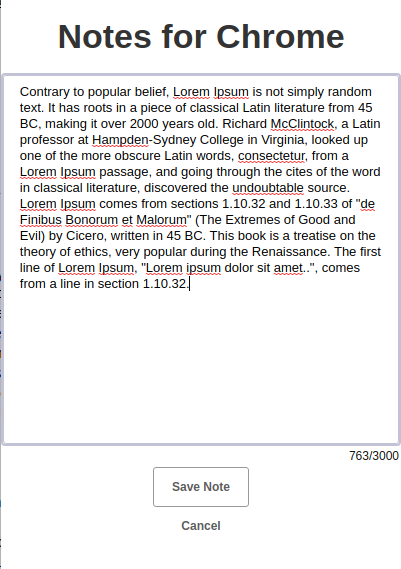

# Notes for Chrome

Find yourself writing post-it notes or needing other apps to take notes when you're browsing in Chrome? Then the Notes
for Chrome extension is for you! This extension enables users to save, browse, edit, and delete notes from within the
browser. Notes are sorted by creation date and are filterable by URL. Plus, your notes are synced! Just sign in with the
same Chrome profile across your devices, and you'll see them appear.

### Images:

    
### Prerequisites to run locally:

1) Node & NPM installed
2) Chrome &ge; v88 installed
3) Notes for Chrome cloned locally to filesystem

### Run locally:

0) Clone git repository and navigate to the created directory.
1) Install dependencies with `npm install`.
2) Build project with `npm run build`.
3) Navigate to address `chrome://extensions/` in Chrome.
4) Ensure `developer mode` is enabled.
5) Click `load unpacked` and open `~/youPathToChromeNotes/ChromeNotes/dist`.
6) Notes for Chrome is now enabled as an extension in your Chrome browser. Enjoy!

View the prototype design on [Figma](https://www.figma.com/file/NkYgkbzqDlh8dw8Rt9HY5L/ChromeNotes?node-id=0%3A1)!