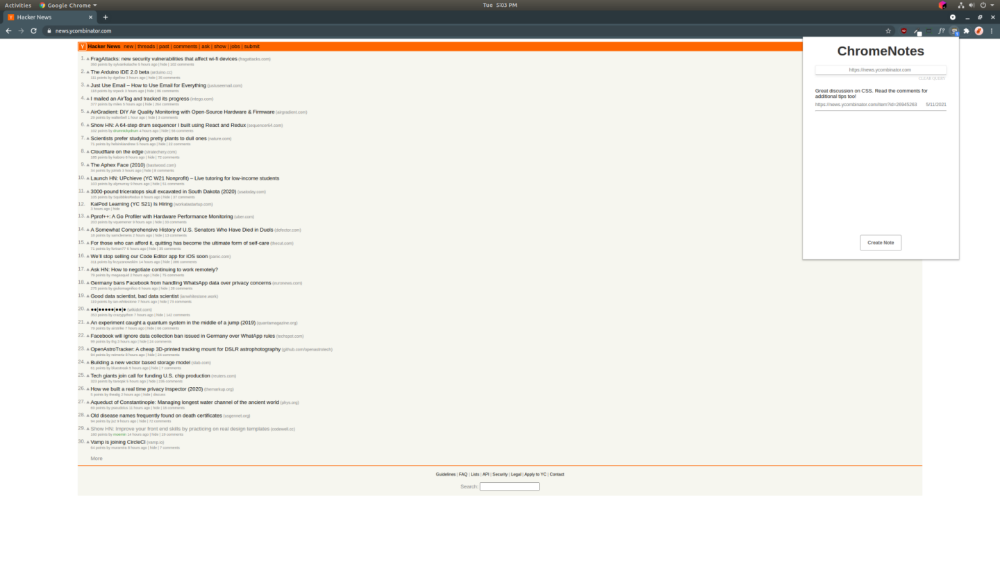
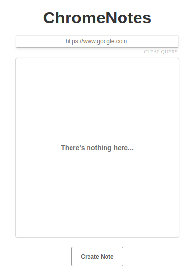
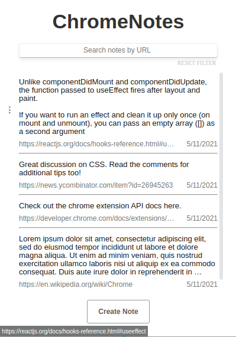

# ChromeNotes

What can it do goes here! Make it sound fun and exciting. Woo!

Find yourself writing post-it notes or using another app to take notes when you're browsing in Chrome? Then the
ChromeNotes extension is for you! This extension enables users to save, browse, edit, and delete notes from within their
browser. Notes are sorted by creation date and are filterable by URL. Plus, notes are synced! Just sign
in with the same Chrome profile across your non-mobile devices, and you'll see them appear.

### Images:

### Prerequisites to run locally:

1) Node & NPM installed
2) Chrome &ge; v88 installed
3) ChromeNotes cloned locally to filesystem

### Run ChromeNotes locally:

0) Open terminal and navigate to locally installed ChromeNotes project.
1) Install dependencies with `npm install`.
2) Build project with `npm run build`.
3) Navigate to address `chrome://extensions/` in Chrome.
4) Ensure `developer mode` is enabled.
5) Click `load unpacked` and open `~/youPathToChromeNotes/ChromeNotes/dist`.
6) ChromeNotes is now enabled as an extension in your Chrome browser. Enjoy!

View the ChromeNotes prototype design
on [Figma](https://www.figma.com/file/NkYgkbzqDlh8dw8Rt9HY5L/ChromeNotes?node-id=0%3A1)!